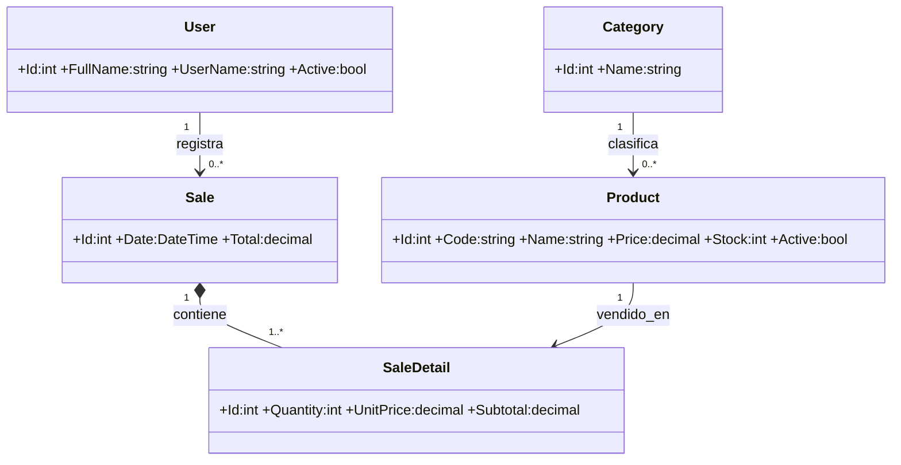

# Manual técnico - FinalControl

## Propósito y tecnología

FinalControl es una aplicación de escritorio para controlar productos, existencias y ventas. Usa C# con .NET 8, Windows Forms, MaterialSkin.2, Entity Framework Core 8, SQL Server LocalDB y QuestPDF.

## Arquitectura

| Capa | Archivo / responsabilidad |
|---|---|
| Presentación | `Forms.cs`: login, panel, categorías, productos y venta. |
| Entidades | `Models.cs`: User, Category, Product, Sale y SaleDetail. |
| Persistencia | `Data.cs`: DbContext, DbSet, Fluent API y datos semilla. |
| Seguridad | `PasswordHasher.cs`: PBKDF2-SHA256, generación de sal y validación compatible con hashes anteriores. |
| Negocio | `Services.cs`: autenticación, CRUD, venta, API, reporte, dashboard y registro de errores. |
| Arranque | `Program.cs`: contenedor DI, HttpClient, migraciones y carga de datos iniciales. |

`Microsoft.Extensions.DependencyInjection` crea servicios y formularios. Así, los formularios no crean directamente el contexto de datos ni los servicios.

## Interfaz y experiencia de uso

La capa visual conserva Windows Forms y MaterialSkin.2, pero comparte una paleta de azul petróleo, fondos claros y texto de alto contraste. El inicio de sesión usa un panel de marca y un formulario compacto con control para mostrar u ocultar la contraseña. El panel principal agrupa las secciones en una barra lateral y presenta indicadores clicables, accesos rápidos, fecha y hora, tipo de cambio y actualización manual.

Las pantallas de productos, categorías y ventas tienen títulos y descripciones consistentes. Las tablas usan filas alternadas, selección visible y encabezados traducidos; las existencias bajas se resaltan. La búsqueda filtra productos y categorías mientras se escribe, y el punto de venta muestra en el pie cuántos artículos/unidades contiene el carrito junto con su total. Los botones y tarjetas responden al cursor para aclarar qué elementos se pueden pulsar. La interfaz no requiere una librería visual nueva ni cambios al esquema de datos.

## Modelo de datos

Las relaciones se configuran en `OnModelCreating` mediante Fluent API. Los códigos de productos y nombres de usuario son únicos. EF Core crea la estructura a partir de la migración `InitialCreate`.

## Reglas importantes

- Un producto requiere código, nombre, categoría, precio y stock válidos. Los servicios recortan espacios de nombres y códigos y comprueban que la categoría exista.
- Las categorías con productos asociados no se pueden eliminar.
- El inventario se desactiva lógicamente para conservar trazabilidad.
- La venta combina las líneas repetidas del mismo producto y valida usuario, identificadores y cantidades.
- Para cada artículo, `SaleService.CreateAsync` ejecuta un descuento SQL condicional que solo se aplica si el producto sigue activo y el stock alcanza. Las ventas se guardan dentro de una transacción; ante cualquier fallo se revierten todos los descuentos y el detalle.

## Contraseñas y compatibilidad

Las contraseñas nuevas se guardan con PBKDF2-SHA256, una sal aleatoria de 16 bytes y 600.000 iteraciones. La comparación usa tiempo constante. La cuenta de demostración se crea con este formato.

Las bases de versiones anteriores pueden contener hashes SHA-256 sin sal. Al primer inicio de sesión válido, la aplicación verifica el hash antiguo y lo sustituye por PBKDF2. No se añade ni modifica ninguna columna para hacer esta actualización. Los scripts SQL antiguos siguen siendo compatibles por esta ruta de actualización.

La cuenta `admin` / `Admin123*` es solo para demostración académica. No se deben guardar datos reales con esas credenciales.

## Concurrencia, API y errores

Las consultas de datos usan `async/await` y las listas de lectura usan consultas sin seguimiento de EF Core. La venta protege el stock con una actualización condicional en la base de datos, incluso si dos ventas intentan consumir las mismas existencias a la vez.

El reloj usa `Timer`; el tipo de cambio consulta una REST API con `HttpClient` y `System.Text.Json`. El cliente HTTP tiene un límite de ocho segundos. Si la API no responde, la interfaz muestra un estado informativo. La creación del PDF se delega a `Task.Run` después de obtener los datos y cada nombre de archivo incluye milisegundos para reducir colisiones.

Los errores se registran con fecha y detalle técnico en `%LOCALAPPDATA%\FinalControl\logs\finalcontrol.log`. El registro usa una sección crítica para evitar escrituras simultáneas y los errores de escritura no convierten una excepción controlada en un cierre inesperado.

## Mejoras aplicadas en esta revisión

- Protección más sólida para las contraseñas nuevas y migración automática al iniciar sesión desde hashes SHA-256 antiguos.
- Prevención de sobreventa por concurrencia mediante descuento condicional de stock, consolidación de líneas repetidas y reversión transaccional.
- Validación adicional de usuario, cantidad, categoría y estado del producto antes de guardar.
- Consultas de lectura sin seguimiento para evitar entidades obsoletas o seguimiento innecesario en pantallas de mantenimiento y ventas.
- Registro en una carpeta del usuario que puede escribirse aun cuando la aplicación esté instalada en una carpeta protegida.
- Límite de espera para el servicio externo y captura de errores de carga inicial de formularios.
- Actualización de README, manual y evidencia para reflejar el comportamiento actual.
- Renovación de la interfaz: login dividido con mostrar contraseña, navegación lateral, resumen con tarjetas y accesos directos, búsqueda de categorías, tablas con mayor legibilidad y señales de stock bajo.
- Carrito de ventas con contador de artículos/unidades, total destacado y aviso cuando se intenta confirmar sin productos.

No se añadió una migración de base de datos ni se cambió el esquema.

## Instalación

1. Instale .NET 8 Desktop Runtime y SQL Server LocalDB.
2. Abra y compile la solución en Visual Studio, o ejecute `publish-release.ps1` y luego abra el `.exe` generado en `Release/FinalControl`.
3. En el primer inicio se aplican las migraciones y se generan los datos de demostración.
4. Para una instalación manual, ejecute `database/FinalControlDb.sql` solamente en una base limpia.

El ZIP de revisión no incluye el directorio `Release` anterior, porque sus binarios no contienen estas correcciones. Genérelo de nuevo con `publish-release.ps1` después de restaurar los paquetes.

## Sugerencias para una siguiente versión

- Añadir cambio de contraseña y administración de usuarios, y retirar la cuenta demo de instalaciones reales.
- Incorporar roles y permisos para separar las acciones de ventas y administración.
- Añadir historial y búsqueda de ventas con opciones de anulación auditada.
- Leer la cadena de conexión desde configuración local, en lugar de fijarla en el código.
