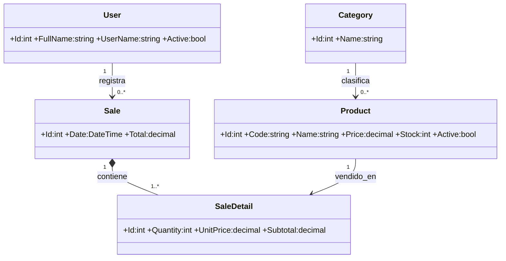

# Manual técnico - FinalControl

## Propósito y tecnología

FinalControl es una aplicación de escritorio para controlar productos, existencias y ventas. Usa C# con .NET 8, Windows Forms, MaterialSkin.2, Entity Framework Core 8, SQL Server LocalDB y QuestPDF.

## Arquitectura

La solución separa responsabilidades para mantener bajo acoplamiento:

| Capa | Archivo / responsabilidad |
|---|---|
| Presentación | `Forms.cs`: login, panel, categorías, productos y venta. |
| Entidades | `Models.cs`: User, Category, Product, Sale y SaleDetail. |
| Persistencia | `Data.cs`: DbContext, DbSet, Fluent API y datos semilla. |
| Negocio | `Services.cs`: autenticación, CRUD, venta, API, reporte, dashboard y log. |
| Arranque | `Program.cs`: contenedor DI, HttpClient y aplicación de migraciones. |

`Microsoft.Extensions.DependencyInjection` crea servicios y formularios. Así, los formularios no crean directamente el contexto de datos ni los servicios.

## Modelo de datos

Las relaciones se configuran en `OnModelCreating` mediante Fluent API. Los códigos de productos y nombres de usuario son únicos. EF Core crea la estructura a partir de la migración `InitialCreate`.

## Reglas importantes

- Un producto requiere código, nombre, categoría, precio y stock válidos.
- Las categorías con productos asociados no se pueden eliminar.
- El inventario se desactiva lógicamente para conservar trazabilidad.
- La venta comprueba que exista suficiente stock.
- `SaleService.CreateAsync` inicia una transacción: descuenta stock, guarda cabecera y detalle, confirma con `Commit`; ante cualquier fallo ejecuta `Rollback`.

## Concurrencia, API y errores

Las consultas de datos usan `async/await`. El reloj usa `Timer`; el tipo de cambio consulta una REST API con `HttpClient` y `System.Text.Json`; la creación del PDF se delega a `Task.Run` tras obtener los datos. Si la API no responde, la interfaz permanece disponible y muestra un estado informativo.

Las excepciones se registran en `logs/finalcontrol.log` junto con fecha y detalle técnico.

## Instalación

1. Instale .NET 8 Desktop Runtime y SQL Server LocalDB.
2. Ejecute el `.exe` contenido en `Release/FinalControl`, o abra la solución en Visual Studio.
3. En el primer inicio, la aplicación se conecta a `(localdb)\MSSQLLocalDB`, crea o actualiza `FinalControlDbFinal` y genera los datos demo.
4. Use `admin` / `Admin123*`.

Para una instalación manual de base de datos, ejecute `database/FinalControlDb.sql` solamente en una base limpia.
